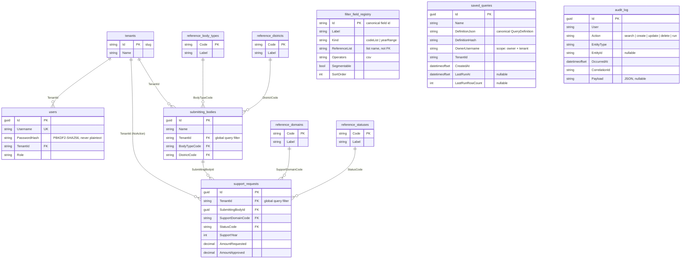
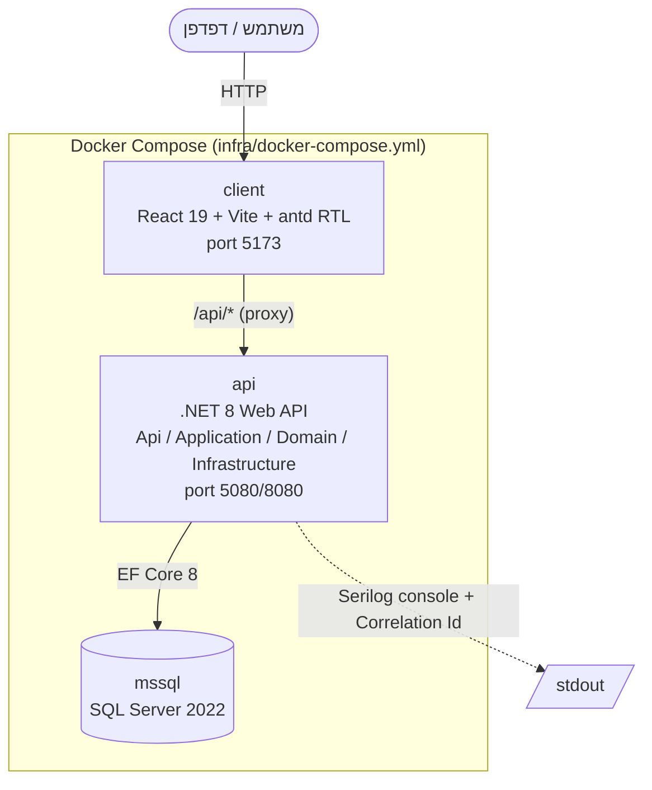

# ארכיטקטורה — מערכת תמיכות רוחבית (PoC)

> **סטטוס: טיוטה (S4).** התוכן נכתב ב-S4 ומתעדכן בכל שלב לפי ה-DoD
> (`IMPLEMENTATION_PLAN.md` §3.8). מקור לתוכן: §4 (ארכיטקטורת יעד) ו-§2
> (החלטות טכנולוגיות נעולות).
>
> **מומש מול מתוכנן.** המסמך מסמן במפורש מה כבר קיים בקוד ומה יעד עתידי:
> פסקאות המתחילות ב-**מומש (S#)** מתארות קוד קיים; פסקאות **יעד (S#)** מתארות
> כיוון שטרם מומש. PoC — ההיקף מכוון, לא שלם.

## 1. סקירה כללית

המערכת מאחסנת בקשות תמיכה ממשלתיות ממספר ארגונים ומאפשרת לתחקר אותן: המשתמש
בוחר פילטרים בטופס, המערכת מתרגמת אותם לשאילתה בטוחה, מריצה אותה מול מסד הנתונים,
ומחזירה ספירה/סכום בפילוח נבחר יחד עם ניסוח השאלה בעברית.

**ה-vertical slice המרכזי** (מומש S1–S3, רץ מקצה-לקצה):

```
GET /api/metadata ──▶ טופס דינמי בלקוח ──▶ QueryDefinition ──▶ POST /api/search
                                                                     │
                        משפט שאלה בעברית + טבלת תוצאות בפילוח ◀───────┘
```

`QueryDefinition` הוא האובייקט הקנוני היחיד שעובר בין כל החלקים (§4.1, §10 החלטה 3):
הטופס בונה אותו, מנוע ה-SQL מתרגם אותו, מנסח השאלה קורא אותו, ובשלבים הבאים גם
ה-NL parser יפיק אותו והשאילתה השמורה *תהיה* הוא.

**רמות** (פירוט ב-§9.2): דפדפן ◀▶ Client (React/Vite) ◀▶ API (.NET 8) ◀▶ SQL Server.
הרצה בפקודה אחת דרך Docker Compose (`infra/docker-compose.yml`).

## 2. שכבות ה-Backend

ארבעה פרויקטים ב-`server/SupportPlatform.sln` (`SupportPlatform.<Layer>`), פרויקט
טסטים אחד לכל שכבה שיש בה קוד. כיוון התלות חד-כיווני:

```
Api ──▶ Application ──▶ Domain
Infrastructure ──▶ Application ──▶ Domain
Api ──▶ Infrastructure   (composition root בלבד — Program.cs)
```

`Application` **לא מפנה ל-EF Core**; `Domain` בלי הפניות framework כלל. כל שכבה חושפת
הרחבת `IServiceCollection` אחת (`AddApplication()` / `AddInfrastructure()`) ו-`Program.cs`
הוא ה-composition root היחיד.

### 2.1 Api

`SupportPlatform.Api` — HTTP בלבד. Controllers דקים (`MetadataController`,
`SearchController`) שעושים bind → קריאה ל-service → `Ok(...)`. בנוסף: Swagger,
`CorrelationIdMiddleware` (`Middleware/`), ומיפוי חריגות ל-RFC 7807 דרך
`IExceptionHandler` + `ProblemTypes` (`Errors/`). אין לוגיקה עסקית ואין גישת נתונים
ב-controller.

### 2.2 Application

`SupportPlatform.Application` — לוגיקת ה-use-cases, DTOs, ולידטורים. מכילה את
`QueryDefinition` הקנוני ואת המשפחה הסגורה `FilterValue` (+`FilterValueJsonConverter`),
את `QueryDefinitionValidator` (FluentValidation), את `QuestionTextRenderer` (משפט
עברית), את `BucketPaging` (מיון/עימוד תוצאה בזיכרון), את `DefinitionHasher`, ואת
`SearchService` / `MetadataService` שבהם כל ההחלטות העסקיות. תלויה על ממשקים בלבד
(`ISearchQueryExecutor`, `ISearchMetadataProvider`, `IMetadataRepository`) שממומשים
ב-Infrastructure.

### 2.3 Domain

`SupportPlatform.Domain` — ישויות ורשומות ייחוס, בלי framework. `Tenant`, `User`,
`SubmittingBody`, `SupportRequest`, ארבע רשומות `Reference*` (בסיס `ReferenceItem`),
ו-`FilterFieldRegistryEntry` — ה-whitelist שממנו נגזרים כל שדות ה-`QueryDefinition`
(§3.4 קו אדום). אין כאן שירותים או לוגיקה — רק המודל.

### 2.4 Infrastructure

`SupportPlatform.Infrastructure` — גישת נתונים ומימושי הממשקים של Application.
`SupportPlatformDbContext` + `IEntityTypeConfiguration` לכל ישות + מיגרציות + `DbSeeder`
(`Persistence/`); `MetadataRepository` (`Repositories/`); ומנוע ה-SQL (`Search/`):
`DynamicQueryBuilder`, היררכיית ה-`FilterHandler` (`Filters/`), `SearchQueryExecutor`,
`SearchMetadataProvider`. גם ה-Global Query Filter של ה-tenant יושב כאן דרך
`ITenantContext`. אין כאן החלטות עסקיות — רק תרגום ל-EF וחזרה.

## 3. מודולים אנכיים

כל מודול חוצה את השכבות (endpoint ב-Api → service ב-Application → נתונים ב-Infrastructure).
שישה מודולים; שלושה מומשו, שלושה עם seams בלבד:

| מודול | סטטוס | מכסה | היכן |
|---|---|---|---|
| **Metadata** | מומש (S1) | `GET /api/metadata` — רשימות ייחוס + `filterFieldRegistry` שמזינים את הטופס הדינמי ואת ה-whitelist | `MetadataController` · `MetadataService` · `MetadataRepository` |
| **Search** | מומש (S2–S3) | `POST /api/search` — ולידציה של `QueryDefinition`, בניית `IQueryable` בטוח, aggregation, משפט שאלה, `executionMeta` | `SearchController` · `SearchService` · `DynamicQueryBuilder` + `Filters/` + `SearchQueryExecutor` |
| **Identity** | חלקי (S5 seam; JWT ב-S8) | login → JWT/`X-User` → זיהוי משתמש → פתירת `TenantId` → הרשאה | `ICurrentUser` (Application) + `HttpCurrentUser` (Api, קורא `X-User`, ברירת מחדל seed user). אין `AuthController`/token/role check עד S8 (§8.1) |
| **Search** (dedup) | מומש (S5) | `definitionHash` קנוני → `IMemoryCache` עם TTL → `executionMeta.cacheHit` | `SearchService` + `DefinitionHasher` + `SearchCacheOptions` (§5.2) |
| **SavedQueries** | מומש (S5) | CRUD scoped ל-owner+tenant + `POST /{id}/run` + `last_run`; out-of-scope → 404 | `SavedQueriesController` · `SavedQueryService` · `SavedQueryRepository` (§5.2) |
| **NlQuery** | יעד (S6) | `POST /api/nl-queries/parse` — טקסט חופשי → `QueryDefinition` דרך `INlQueryTranslator` + Factory | חוזה ב-`api-contract.md` §4; טרם מומש |
| **Audit** | מומש (S5) | `IAuditService.Record(...)` — קריאות מפורשות ב-services (לא interceptor) על mutations + search | `AuditService` (Infrastructure) → `audit_log` (§5.2) |

חתכים רוחביים (Correlation Id, Serilog, ProblemDetails, Validation) משותפים לכל
המודולים ומפורטים ב-§8.

## 4. מנוע השאילתות

חוזה: [`contracts/query-definition.md`](contracts/query-definition.md) ·
[`contracts/api-contract.md`](contracts/api-contract.md) §3. מומש ב-S2.

### 4.1 `QueryDefinition` — האובייקט הקנוני

רשומה ב-`Application/Search/QueryDefinition.cs`: `TenantId` · `Filters`
(מילון `fieldId → FilterValue`) · `Segmentation` · `Metrics` · `Paging` · `Sort`.
`FilterValue` הוא היררכיה סגורה (`Codes` · `YearRange` · `YearSingle`) עם
`FilterValueJsonConverter` שקורא מערך JSON כרשימת codes ואובייקט `{type}` כפילטר שנה.

### 4.2 ולידציה מול ה-Registry

`QueryDefinitionValidator` (FluentValidation) נטען דרך `ISearchMetadataProvider`
(reference lists + registry + רשימת ה-tenants). נדחים ב-400 (`error-model.md`):
`filters` key / `segmentation` / `sort.field` שאינו ב-registry, ערך שצורתו לא
תואמת ל-`kind`, שדה לא-`segmentable` בפילוח, טווח שנים הפוך, metric/direction לא
מוכר, `pageSize` מחוץ ל-1–200, tenant לא קיים.

### 4.3 `DynamicQueryBuilder` + היררכיית ה-handlers (§3.4 קו אדום)

`DynamicQueryBuilder` (Infrastructure) הוא מתזמן דק: קודם **דוחה כל `fieldId`
שאינו ב-registry — לפני שרץ handler כלשהו** — ואז מקפל את ה-handlers שנפתרו.
אין `switch` לפי `fieldId`, אין reflection, אין expression-from-string.

- `FilterHandler` (abstract) — תת-מחלקה אחת לכל `kind`: `CodeListFilterHandler`
  (IN מעל עמודת code), `YearRangeFilterHandler` (טווח / שנה בודדת — pattern
  match סגור על צורת הערך). ה-guard בבסיס בודק את צורת הערך מול ה-`kind`.
- **instance אחד לכל שדה**, נושא את ה-selector החזק שלו
  (`Expression<Func<SupportRequest,string|int>>`). אותו instance מסנן (`Apply`),
  מקבץ ב-DB לפי אותה עמודה (`AggregateGroups`), ומספק את מפתח הפילוח בזיכרון
  (`GroupKeySelector` / `GroupKey`). הרישום ב-`FilterHandlers.Default`.
- `FilterHandlerResolver` ממפה `fieldId → handler` (מתוך `IEnumerable<FilterHandler>`
  ב-DI). שדה סינון חדש = שורת רישום אחת; `kind` חדש = תת-מחלקה אחת. ה-resolver,
  ה-builder וה-executor לא משתנים — אין `switch` לפי טיפוס handler קונקרטי.

### 4.4 Aggregation + `SearchQueryExecutor` + `BucketPaging`

`SearchQueryExecutor` (Infrastructure) עושה רק גישת-נתונים: מחיל את ה-tenant scope
(מ-`QueryDefinition.TenantId` שכבר עבר ולידציה), מריץ את ה-builder, ומחזיר את **כל**
קבוצות ה-aggregation (count + sumAmountApproved תמיד מחושבים):

- **0 שדות פילוח** → aggregate בודד ב-DB.
- **שדה פילוח אחד** → `handler.AggregateGroups` — `GroupBy` ב-DB לפי עמודת ה-handler.
- **2+ שדות** → materialization מינימלי + GroupBy בזיכרון (פשטת PoC; שאילתות
  כבדות = `DESIGN_QA` §4).

מיון (לפי `Sort`, אחרת לפי שדות ה-`segmentation` בסדר עולה) וחיתוך העמוד נעשים
אחרי כן ב-`BucketPaging` (Application) — עיצוב תוצאה טהור בזיכרון, מחוץ ל-executor
של ה-EF. ה-service מקרין רק את ה-metrics שהתבקשו.

הסכומים נלקחים מעל `double` כדי שה-provider של SQLite בטסטים יתרגם את ה-aggregate;
SQL Server היה שומר `decimal` נייטיב (הסכומים קטנים דיים כדי שזה יהיה מדויק לאגורה).
מיון וניפוי עמודים על ה-buckets; `page.totalRows` = מספר הקבוצות לפני עימוד.

### 4.5 `QuestionTextRenderer`

בונה את משפט העברית מהניסוח שהחוזה מגדיר בפועל
([`query-definition.md`](contracts/query-definition.md) "Reads as" +
`api-contract.md` §3): הפתיח "כמה בקשות תמיכה", תוויות ה-registry, תוויות ערכי
הייחוס, וסעיף "בפילוח לפי". אין ניסוח מומצא מעבר לכך; ל-metric הסכום אין ניסוח
בחוזה ולכן הוא לא מתואר במשפט.

### 4.6 גבולות אחריות

Controller (`SearchController`) = HTTP בלבד: bind → `ISearchService` → תוצאה.
כל החלטה עסקית (ולידציה, בחירת metrics, הרכבת התשובה, hashing, תזמון) ב-`SearchService`.
Infrastructure = גישת נתונים בלבד (EF, builder, handlers, החלת ה-tenant scope).

## 5. מסד נתונים

**המימוש: SQL Server** (`mcr.microsoft.com/mssql/server:2022` ב-Compose). הבחירה
מעשית ל-PoC — היכרות ורישוי קיימים מקצרים את זמן ההקמה, שהוא המשאב הקריטי כאן (§3.1
בתוכנית).

**היעד המועדף: PostgreSQL** כמסד קוד-פתוח, ללא עלות רישוי, מתאים לפריסה ממשלתית.
המודל **provider-agnostic**: הגישה כולה דרך EF Core 8 עם `IQueryable`, בלי SQL גולמי
ובלי פיצ'רים ספציפיים לספק. מעבר ל-PostgreSQL = החלפת חבילת ה-provider
(`Npgsql.EntityFrameworkCore.PostgreSQL`), עדכון connection string, והרצת המיגרציות
מחדש. שדות JSON עתידיים (למשל `audit_log.payload`) נשמרים כ-`nvarchar(max)` + `ToJson()`,
מבנה שמתמפה ל-`jsonb` ב-PostgreSQL.

הסכומים (`AmountRequested` / `AmountApproved`) הם `decimal` נייטיב ב-SQL Server;
בטסטים (provider SQLite) ה-aggregate מחושב מעל `double` כדי שה-provider יתרגם אותו
(§4.4). הסכומים קטנים דיים כדי שזה יישאר מדויק לאגורה.

### 5.1 מודל הנתונים (מומש ב-S1)

ישויות ב-`SupportPlatform.Domain/Entities/`, מיפוי ב-`Infrastructure/Persistence/Configurations/`:

| ישות | טבלה | tenant-scoped |
|---|---|---|
| `Tenant` | `tenants` | – (מפתח: slug) |
| `User` | `users` | `TenantId` (FK) — מוכן ל-JWT של S8, ללא לוגיקת אימות ב-S1 |
| `SubmittingBody` | `submitting_bodies` | ✔ Global Query Filter |
| `SupportRequest` | `support_requests` | ✔ Global Query Filter |
| `ReferenceDomain/BodyType/Status/District` | `reference_*` | – (גלובלי ל-PoC) |
| `FilterFieldRegistryEntry` | `filter_field_registry` | – (whitelist, §3.4) |

- **בידוד tenant — fail-closed:** ה-Global Query Filter הוא
  `e => tenant.HasTenant && e.TenantId == tenant.TenantId`. בלי tenant context מוגדר —
  אפס שורות, לא "הכל". גישה חוצת-tenant רק דרך `IgnoreQueryFilters()` מפורש (טסטים / admin).
  `ITenantContext` נקבע ב-S1 מפרמטר הפיתוח `?tenantId=`; ב-S8 מהמשתמש המאומת.
- **Migrations:** `InitialCreate` · `TenantAndReferenceFkDeleteBehavior` · `SavedQueriesAndAudit`
  (S5 — additive: רק `saved_queries` + `audit_log`, ללא שינוי טבלה קיימת) תחת
  `Infrastructure/Persistence/Migrations/`. כלי: `dotnet-ef` כ-local tool
  (`server/.config/dotnet-tools.json`).
- **Seed (`DbSeeder`, דטרמיניסטי ו-idempotent):** שורות ייחוס + 5 שורות registry (מ-`metadata-model.md`
  מילה במילה) · 2 tenants (`culture-sport-admin`, `welfare-admin`) · 3 משתמשי seed עם hash דטרמיניסטי
  (`SeedPasswordHasher`, PBKDF2-SHA256, ללא סיסמאות גולמיות) · ~40 `submitting_bodies` · ~500
  `support_requests` בהתפלגות מכוונת (שנים 2023–2025 30/40/30, סטטוס 55/25/20, תחום 60/40, שני tenants
  320/180). מופעל ב-`Program.cs` ב-Development בלבד (`Migrate()` + `Seed()`).
- **`?tenantId=` הוא חוזה פיתוח זמני ל-S1** — ראה §8.

### 5.2 שאילתות שמורות, Audit ו-dedup (מומש ב-S5)

**זהות הקורא (seam).** `ICurrentUser` (Application: `Username` / `TenantId` / `Role` /
`CorrelationId`) עם מימוש `HttpCurrentUser` (Api) שקורא את הכותרת `X-User` ומאתר את שורת
ה-`users` ה-seeded; כותרת חסרה או לא מוכרת → ברירת המחדל `sarah`. זה חוזה ה-PoC
מ-`api-contract.md` §Auth; JWT ובדיקת role אמיתית — S8. אין הרשאה מעבר ל-scoping של
owner + tenant.

**`saved_queries`.** `SavedQueryService` (Application) מבצע CRUD + `run`; `SavedQueryRepository`
(Infrastructure) מסנן **תמיד** לפי `OwnerUsername` + `TenantId`. גישה לרשומה מחוץ ל-scope →
`NotFoundException` → 404 (לא 403 — לא מדליף קיום, `api-contract.md` §5). ה-`definition`
נשמר כ-JSON קנוני + `DefinitionHash`, ומאומת ב-POST/PUT דרך אותו `IValidator<QueryDefinition>`
כמו `/api/search`. `run` מריץ דרך `ISearchService`, מעדכן `LastRunAt` / `LastRunRowCount`.

**Dedup (`DESIGN_QA` §5).** `SearchService` מחשב `DefinitionHasher.Hash` (מפתחות filters,
codes ו-metrics ממוינים; `segmentation`/`sort` נשמרים כסדרם) ומשתמש בו כמפתח `IMemoryCache`.
פגיעה → מוחזרת התוצאה השמורה עם `executionMeta.cacheHit = true`. TTL מ-`Search:CacheTtlSeconds`
(ברירת מחדל 60ש'); `0` מכבה dedup לגמרי (מנוף ה-fallback §7.3). ה-cache הוא per-instance
בזיכרון — מכוון ל-PoC.

**`audit_log`.** `IAuditService.Record(action, entityType, entityId, payload)` — קריאות
מפורשות ב-services (לא EF interceptor): `search` על כל חיפוש, ו-`create`/`update`/`delete`/`run`
על שאילתות שמורות. `AuditService` (Infrastructure) חותם `User` + `CorrelationId` מ-`ICurrentUser`
ושומר `payload` כ-JSON. `occurred_at` מאונדקס.

## 6. Client

React + TypeScript + Vite, Ant Design v6 ב-RTL (`ConfigProvider direction="rtl"` +
`he_IL`), TanStack Query. מבנה `src/`: `api/` · `components/` (גנרי) · `models/` ·
`features/<feature>/` (כל feature: קומפוננטות + `hooks/`) · `state/` (רק ה-`queryClient`
המשותף).

### 6.1 ה-Vertical slice (מומש ב-S3)

`metadata → טופס דינמי → QueryDefinition → POST /api/search → משפט שאלה + טבלה`, הכל
במסך אחד (`features/search/SearchPage`). התוצאות מוצגות **inline** מתחת לטופס; אין מסך
`/results` נפרד (יוחזר ב-S7 אם צריך).

- **`api/` — ה-seam היחיד ל-HTTP.** `http.ts` עוטף `fetch`: על תשובה לא-2xx הוא מנתח
  `application/problem+json` ([`error-model.md`](contracts/error-model.md)), מרים
  `notification.error` (ה-"interceptor" של §4 בתוכנית) וזורק `ApiError`. שירותים
  (`metadataApi`, `searchApi`) מחזירים טיפוסים מ-`models/`; קומפוננטות לא קוראות `fetch`.
- **טופס דינמי מ-`filterFieldRegistry`.** `SearchForm` מרנדר פקד אחד לכל רשומת registry
  לפי סדר המערך — `codeList` → multi-select מ-`references[referenceList]`, `yearRange` →
  זוג from/to. פקד הפילוח מציע רק רשומות `segmentable`. שום שדה לא מקודד קשיח; שורת
  registry חדשה = פקד חדש בטעינה הבאה (§8 Q1, צד הלקוח).
- **`QueryDefinition` נבנה בלקוח.** `buildQueryDefinition` (פונקציה טהורה) ממפה את מצב
  הטופס לאובייקט הקנוני: פקדים ריקים מושמטים, שנה עם שני קצוות → `range` ועם קצה אחד →
  `single`, `metrics` תמיד `["count"]` ב-S3. ולידציה חוצת-שדות (טווח הפוך, id לא מוכר)
  נשארת בשרת.
- **שאלה קריאה "חיה".** שינויי טופס עוברים debounce (~400ms, `useDebouncedValue`) ואז
  `POST /api/search`; הפאנל מציג את `questionText` **מהשרת** (`QuestionTextRenderer`,
  §4.5) — אין renderer שני בלקוח.
- **עימוד ומיון בצד השרת.** `ResultsTable` בונה עמודות דינמית מ-`segmentation` +
  `metrics`, וממפה את `onChange` של `antd` Table ל-`paging` / `sort` ב-`QueryDefinition`;
  `page.totalRows` מזין את סה"כ העמודים. מצבי loading / empty / error מטופלים
  (`ResultsPanel` — באנר שגיאה עם `traceId`; ריק / טעינה — ברירת המחדל של הטבלה).
- **Tenant + user.** `DEFAULT_TENANT_ID` ו-`DEFAULT_USER` קבועים זמניים (`api/config.ts`);
  `http.ts` שולח `X-User` בכל בקשה. אין `login` עדיין — S8 יחליף בזהות המאומתת.

### 6.2 מסך שאילתות שמורות (מומש ב-S5)

`features/saved-queries/`: `useSavedQueries` (TanStack Query — list + rename/delete/run) למסך עצמו,
`useCreateSavedQuery` (mutation בלבד, בלי query — כדי ש-`SaveQueryButton` במסך החיפוש לא ימשוך את
הרשימה), `SavedQueriesTable` (הרצה מחדש / שינוי שם / מחיקה לכל שורה), `RenameQueryModal`. שירות HTTP יחיד `savedQueriesApi` דרך
`http` (נוספו `put` / `del`). הרצה מחדש מציגה את `questionText` + סה"כ שורות מהתשובה.

## 7. הרחבה עתידית

המערכת מונעת-metadata: הטופס, ה-whitelist, ומשפט השאלה כולם נגזרים מרשומות במסד
(`reference_*` + `filter_field_registry`), לא מקוד. שלוש רמות הרחבה, מהזולה לכואבת:

### 7.1 ערך חדש לשדה קיים — **אפס קוד** (הדגמת §11 / DESIGN_QA §1)

תרחיש: משרד התרבות מוסיף תחום תמיכה **"חינוך"**. כל מה שנדרש הוא שורת נתונים:

```
reference_domains: { code: "education", label: "חינוך" }
```

(דרך `DbSeeder`, מיגרציית data, או INSERT). מה שקורה מקצה-לקצה **בלי לגעת בקוד**:

1. `GET /api/metadata` — `MetadataRepository` קורא את `reference_domains`; התשובה
   מחזירה כעת `references.domains` עם `education`. ה-`filterFieldRegistry` לא משתנה
   (`supportDomain` כבר שם).
2. **טופס הלקוח** — `SearchForm` מרנדר את פקד `supportDomain` מ-`references.domains`;
   האופציה "חינוך" מופיעה מעצמה. אף קומפוננטה לא משתנה.
3. **`QueryDefinition`** — `buildQueryDefinition` מייצר `filters.supportDomain =
   ["education"]` כמו לכל code אחר.
4. **ולידציה** — `QueryDefinitionValidator` בודק ש-`supportDomain` ב-registry (כן)
   ושצורת הערך תואמת ל-`kind` (מערך codes). עובר.
5. **מנוע ה-SQL** — `DynamicQueryBuilder` מוצא ש-`supportDomain` ב-registry ומעביר
   ל-`CodeListFilterHandler` הקיים של השדה (selector `r => r.SupportDomainCode`),
   שמפיק `WHERE SupportDomainCode IN ('education')`.
6. **משפט השאלה** — `QuestionTextRenderer` לוקח את התווית מרשימת הייחוס → "בתחום חינוך".

אותו נתיב תקף לכל code חדש של `bodyTypes` / `statuses` / `districts`.

### 7.2 שדה סינון חדש מעל `kind` קיים — **שורת רישום אחת**

תרחיש: להוסיף פילטר "מקור מימון" (code list). נדרש:

- שורות ב-`reference_*` החדשה + שורה ב-`filter_field_registry`
  (`id: "fundingSource", kind: "codeList", referenceList: "fundingSources", …`);
- **שורה אחת** ב-`Infrastructure/Search/Filters/FilterHandlers.Default`:
  `new CodeListFilterHandler("fundingSource", r => r.FundingSourceCode)` (+ העמודה
  על הישות).

הטופס, ה-validator, ה-builder, ה-resolver, ומנסח השאלה — לא משתנים.

### 7.3 סוג סינון חדש (`kind` חדש — טווח מספרי, טקסט חופשי) — **תת-מחלקה אחת**

תת-מחלקה חדשה של `FilterHandler` (כמו `YearRangeFilterHandler`) + שורת registry עם
ה-`kind` החדש + פקד תואם בלקוח. `DynamicQueryBuilder` ו-`FilterHandlerResolver` לא
משתנים — אין `switch` על סוג handler (§10 החלטה 4).

## 8. חתכים רוחביים

מומשו ב-S2 (יחד עם `POST /api/search`):

- **Correlation Id** — `CorrelationIdMiddleware` לוקח `X-Correlation-Id` מה-request
  או מייצר; מחזיר אותו ב-response, דוחף ל-Serilog `LogContext`, וקובע אותו כ-
  `HttpContext.TraceIdentifier` כך שהוא צף כ-`traceId` ב-ProblemDetails.
- **Serilog** — Console sink, `ILogger<T>` בהזרקה, בלי multi-sink config.
- **ProblemDetails (RFC 7807, [`contracts/error-model.md`](contracts/error-model.md))** —
  `AddProblemDetails` + `IExceptionHandler` (`Api/Errors`): `ValidationException`
  ו-`InvalidQueryException` → 400 `validation` עם `errors{}`; כל השאר → 500 `unexpected`
  מתועד. ה-`type`/`title` מ-`ProblemTypes`.
- **Validation** — FluentValidation על `QueryDefinition`, נבדק ב-service לפני שימוש.

נוספו ב-S5: **Audit Log** (`IAuditService.Record`, קריאות מפורשות — §5.2) · **caching/dedup**
(`definitionHash` → `IMemoryCache` — §5.2) · **seam זהות** (`ICurrentUser` מ-`X-User`).
עדיין לפי הבנייה: Auth מלא (JWT + הנפקת token + role check) — S8.

### 8.1 גבול האימות (יעד S8; ב-S1 רק הנתונים)

זרימת היעד: `login → אימות credentials מול User.PasswordHash → הנפקת JWT → Bearer
authentication → זיהוי User → פתירת TenantId מה-User → הרשאה + בידוד tenant`.

- ב-S1 קיימת רק ישות `User` (עם hash דטרמיניסטי) — אין `AuthController`, אין הנפקת token,
  אין middleware. אין JWT מזויף/stub.
- `GET /api/metadata?tenantId=` הוא **חוזה פיתוח זמני ל-S1**. משהאימות ינחת ב-S8, ה-tenant של
  המשתמש המאומת הוא מקור הסמכות; **ה-API לא יבטח `tenantId` מהלקוח לצורך הרשאה** — הוא ישמש
  לכל היותר לבדיקת התאמה מול ה-token (אחרת 403, ראה `error-model.md`).

## 9. דיאגרמות

### 9.1 ERD

מודל S1 (§5.1). `tenants` הוא ה-scope; `support_requests` היא טבלת העובדות שמנוע
השאילתות רץ עליה. רשומות ה-`reference_*` מקושרות ב-code (מחרוזת יציבה), עם
`OnDelete(Restrict)` — מחיקת שורת ייחוס לא מוחקת נתונים עסקיים. `filter_field_registry`
עומד בפני עצמו (ה-whitelist), `ReferenceList` שלו הוא שם רשימה, לא FK.



> `saved_queries` ו-`audit_log` נוספו ב-S5 (§5.2). אין להן FK ל-`tenants`/`users` — ה-scoping
> נאכף מפורשות ב-repository / service, לא דרך Global Query Filter.

### 9.2 Container diagram



יעד (לא ב-Compose הנוכחי): API gateway / reverse proxy, מסד logs מרוכז, ספק AI
חיצוני מאחורי `INlQueryTranslator` (§10 החלטה 8, DESIGN_QA §8).

## 10. Decision Log

החלטות מהותיות: מה הוחלט, למה, ואילו חלופות נשקלו. מתעדכן תוך כדי.

### 1. SQL Server למימוש, PostgreSQL כיעד

מימוש מול SQL Server (§5): היכרות ורישוי קיימים — זמן הקמה הוא המשאב הקריטי ב-PoC.
כדי שזה לא ינעל, כל הגישה דרך EF Core `IQueryable` בלבד, בלי SQL גולמי. במסמך היעד
PostgreSQL הוא המומלץ (קוד פתוח, ללא רישוי). **חלופה שנדחתה:** SQLite למימוש — פשוט
יותר להרים, אבל לא מייצג עומס/concurrency אמיתיים ולא נפרס בפרודקשן. SQLite כן משמש
בטסטים בלבד.

### 2. ארבע שכבות עם תלות חד-כיוונית

`Api / Application / Domain / Infrastructure`, `Application` לא מכיר EF (§2). זה
אוצר-המילים של המטלה ומאפשר להחליף provider או לבודד לוגיקה בטסט בלי framework.
**חלופה שנדחתה:** פרויקט יחיד — פחות ceremony, אבל מטשטש את הגבול Service↔גישת-נתונים
שהמטלה מודדת עליו.

### 3. `QueryDefinition` כאובייקט קנוני יחיד

מבנה אחד ([`contracts/query-definition.md`](contracts/query-definition.md)) שהטופס
בונה, מנוע ה-SQL מתרגם, מנסח השאלה קורא, ובהמשך ה-NL parser יפיק והשאילתה השמורה
תאחסן. מונע שכפול לוגיקה ו-drift בין הצרכנים. **חלופה שנדחתה:** DTO נפרד לכל endpoint.

### 4. Whitelist מ-`FilterFieldRegistry` + היררכיית handlers, בלי `switch`

`DynamicQueryBuilder` דוחה כל `fieldId` שאינו ב-registry לפני שרץ handler (§3.4 קו
אדום, §4.3). לכל שדה instance אחד של `FilterHandler` הנושא selector חזק
(`Expression<Func<…>>`); `kind` חדש = תת-מחלקה, שדה חדש = שורת רישום. **חלופות
שנדחו:** (א) `switch (fieldId)` מרכזי — נשבר עם כל שדה; (ב) בניית expression
ממחרוזת / reflection — משטח התקפה של injection, בדיוק מה שהמטלה בודקת.

### 5. בידוד tenant fail-closed דרך Global Query Filter

`e => tenant.HasTenant && e.TenantId == tenant.TenantId` על `SupportRequest` +
`SubmittingBody` (§5.1). בלי tenant context — אפס שורות, לא "הכל". חוצה-tenant רק
דרך `IgnoreQueryFilters()` מפורש. **חלופה שנדחתה:** סינון ידני בכל repository — שכחה
אחת = דליפת נתונים בין ארגונים.

### 6. `?tenantId=` כחוזה פיתוח זמני ל-S1

`GET /api/metadata?tenantId=` מקבל את ה-tenant מ-query param עד S8 (§8.1). ב-S8
המשתמש המאומת הוא מקור הסמכות וה-API לא יבטח `tenantId` מהלקוח. תועד במפורש כדי
שלא ייחשב כמנגנון הרשאה.

### 7. עיצוב תוצאה (מיון/עימוד) ב-Application, לא ב-Infrastructure

`SearchQueryExecutor` מחזיר את כל קבוצות ה-aggregation; `BucketPaging` (Application)
ממיין וחותך עמוד בזיכרון (§4.4). שומר את Infrastructure "גישת-נתונים בלבד".
**פשטת PoC מודעת:** 2+ שדות פילוח → GroupBy בזיכרון; שאילתות כבדות אמיתיות =
DESIGN_QA §4.

### 8. חתכים רוחביים מוזרקים ב-S2 יחד עם `/search`

Correlation Id + Serilog + ProblemDetails (RFC 7807) נכנסו כשהיה endpoint אמיתי
לתלות בו (§8), לא כתשתית מוקדמת בלי צרכן. **Audit ו-cache נכנסו ב-S5** עם הצרכן הראשון
שלהם (שאילתות שמורות + חיפוש חוזר); Auth מלא נשאר seam עד S8 — §3.2 בתוכנית,
"אפס over-engineering".

### 9. הלקוח בונה `QueryDefinition`, השרת מנסח את השאלה

`buildQueryDefinition` (טהור) בלקוח בונה את המבנה; `questionText` מגיע תמיד מהשרת
(`QuestionTextRenderer`) — אין renderer עברית שני בלקוח (§6.1). מקור אמת אחד למשפט.

### 10. זהות PoC דרך `X-User`, scoping ב-service, לא interceptor (S5)

שאילתות שמורות ו-audit דורשים "מי הקורא". במקום JWT מוקדם (S8), `ICurrentUser` נגזר
מכותרת `X-User` מול ה-seed users, עם ברירת מחדל. ה-scoping (owner + tenant) נאכף
מפורשות ב-`SavedQueryRepository`/`SavedQueryService`, וה-audit נכתב בקריאות
`IAuditService.Record` מפורשות מה-service — **לא** EF `SaveChanges` interceptor: הקריאה
המפורשת נראית בקוד ה-use-case, נושאת payload סמנטי, ולא מפעילה audit על כתיבות פנימיות.
**חלופה שנדחתה:** interceptor גלובלי — "קסום", קשה לצרף לו action/payload נכונים, וכותב
גם על שמירת שורת ה-audit עצמה.
