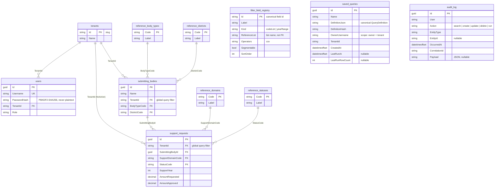
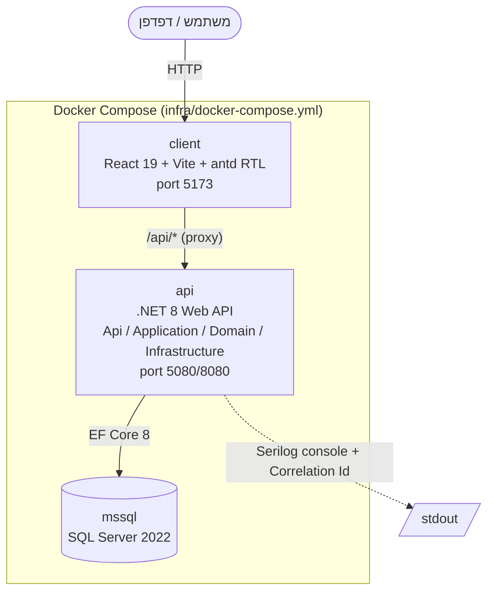

# ארכיטקטורה — מערכת תמיכות רוחבית (PoC)

> **מומש מול מתוכנן.** המסמך מסמן במפורש מה כבר קיים בקוד (**מומש**) ומה כיוון
> עתידי שטרם מומש (**מתוכנן**). PoC — ההיקף מכוון, לא שלם.

## 1. סקירה כללית

המערכת מאחסנת בקשות תמיכה ממשלתיות ממספר ארגונים ומאפשרת לתחקר אותן: המשתמש
בוחר פילטרים בטופס, המערכת מתרגמת אותם לשאילתה בטוחה, מריצה אותה מול מסד הנתונים,
ומחזירה ספירה/סכום בפילוח נבחר יחד עם ניסוח השאלה בעברית.

**ה-vertical slice המרכזי** (רץ מקצה-לקצה):

```
GET /api/metadata ──▶ טופס דינמי בלקוח ──▶ QueryDefinition ──▶ POST /api/search
                                                                     │
                        משפט שאלה בעברית + טבלת תוצאות בפילוח ◀───────┘
```

`QueryDefinition` הוא האובייקט הקנוני היחיד שעובר בין כל החלקים (§4.1, §10):
הטופס בונה אותו, מנוע ה-SQL מתרגם אותו, מנסח השאלה קורא אותו, ובשלבים הבאים גם
ה-NL parser יפיק אותו והשאילתה השמורה *תהיה* הוא.

**רמות** (פירוט ב-§9.2): דפדפן ◀▶ Client (React/Vite) ◀▶ API (.NET 8) ◀▶ SQL Server.
הרצה בפקודה אחת דרך Docker Compose (`infra/docker-compose.yml`).

## 2. שכבות ה-Backend

ארבעה פרויקטים ב-`server/SupportPlatform.sln` (`SupportPlatform.<Layer>`), פרויקט
טסטים אחד לכל שכבה שיש בה קוד. כיוון התלות חד-כיווני:

```
Api ──▶ Application ──▶ Domain
Infrastructure ──▶ Application ──▶ Domain
Api ──▶ Infrastructure   (composition root בלבד — Program.cs)
```

`Application` **לא מפנה ל-EF Core**; `Domain` בלי הפניות framework כלל. כל שכבה חושפת
הרחבת `IServiceCollection` אחת (`AddApplication()` / `AddInfrastructure()`) ו-`Program.cs`
הוא ה-composition root היחיד.

### 2.1 Api

`SupportPlatform.Api` — HTTP בלבד. Controllers דקים (`MetadataController`,
`SearchController`) שעושים bind → קריאה ל-service → `Ok(...)`. בנוסף: Swagger,
`CorrelationIdMiddleware` (`Middleware/`), ומיפוי חריגות ל-RFC 7807 דרך
`IExceptionHandler` + `ProblemTypes` (`Errors/`). אין לוגיקה עסקית ואין גישת נתונים
ב-controller.

### 2.2 Application

`SupportPlatform.Application` — לוגיקת ה-use-cases, DTOs, ולידטורים. מכילה את
`QueryDefinition` הקנוני ואת המשפחה הסגורה `FilterValue` (+`FilterValueJsonConverter`),
את `QueryDefinitionValidator` (FluentValidation), את `QuestionTextRenderer` (משפט
עברית), את `BucketPaging` (מיון/עימוד תוצאה בזיכרון), את `DefinitionHasher`, ואת
`SearchService` / `MetadataService` שבהם כל ההחלטות העסקיות. תלויה על ממשקים בלבד
(`ISearchQueryExecutor`, `ISearchMetadataProvider`, `IMetadataRepository`) שממומשים
ב-Infrastructure.

### 2.3 Domain

`SupportPlatform.Domain` — ישויות ורשומות ייחוס, בלי framework. `Tenant`, `User`,
`SubmittingBody`, `SupportRequest`, ארבע רשומות `Reference*` (בסיס `ReferenceItem`),
ו-`FilterFieldRegistryEntry` — ה-whitelist שממנו נגזרים כל שדות ה-`QueryDefinition`
(§3.4 קו אדום). אין כאן שירותים או לוגיקה — רק המודל.

### 2.4 Infrastructure

`SupportPlatform.Infrastructure` — גישת נתונים ומימושי הממשקים של Application.
`SupportPlatformDbContext` + `IEntityTypeConfiguration` לכל ישות + מיגרציות + `DbSeeder`
(`Persistence/`); ה-repositories (`Repositories/`) — `MetadataRepository`,
`SavedQueryRepository`, ומ-S8 גם `SupportRequestRepository` (`IQueryable` למנוע החיפוש)
ו-`TenantRepository` (`IRepository<Tenant>`); ומנוע ה-SQL (`Search/`):
`DynamicQueryBuilder`, היררכיית ה-`FilterHandler` (`Filters/`), `SearchQueryExecutor`,
`SearchMetadataProvider`. גם ה-Global Query Filter של ה-tenant יושב כאן דרך
`ITenantContext`. אין כאן החלטות עסקיות — רק תרגום ל-EF וחזרה.

## 3. מודולים אנכיים

כל מודול חוצה את השכבות (endpoint ב-Api → service ב-Application → נתונים ב-Infrastructure).
שישה מודולים, כולם מומשו (Identity — auth stub מבוסס `X-User`, בלי JWT — §8.1):

| מודול | סטטוס | מכסה | היכן |
|---|---|---|---|
| **Metadata** | מומש | `GET /api/metadata` — רשימות ייחוס + `filterFieldRegistry` שמזינים את הטופס הדינמי ואת ה-whitelist | `MetadataController` · `MetadataService` · `MetadataRepository` |
| **Search** | מומש | `POST /api/search` — ולידציה של `QueryDefinition`, בניית `IQueryable` בטוח, aggregation, משפט שאלה, `executionMeta` | `SearchController` · `SearchService` · `DynamicQueryBuilder` + `Filters/` + `SearchQueryExecutor` |
| **Identity** | מומש (auth stub) | `X-User` → זיהוי משתמש → `TenantId` + `Role` סמכותיים → `TenantAccessGuard` (tenant זר בגוף/query = 403) + כלל role אחד (מחיקת שאילתה שמורה דורשת `admin`) | `ICurrentUser` + `TenantAccessGuard` + `Roles` (Application) · `HttpCurrentUser` (Api, קורא `X-User`). בלי JWT/`AuthController` — יעד production (§8.1) |
| **Search** (dedup) | מומש | `definitionHash` קנוני → `IMemoryCache` עם TTL → `executionMeta.cacheHit` | `SearchService` + `DefinitionHasher` + `SearchCacheOptions` (§5.2) |
| **SavedQueries** | מומש | CRUD scoped ל-owner+tenant + `POST /{id}/run` + `last_run`; out-of-scope → 404 | `SavedQueriesController` · `SavedQueryService` · `SavedQueryRepository` (§5.2) |
| **NlQuery** | מומש | `POST /api/nl-queries/parse` — טקסט חופשי → `QueryDefinition` דרך `INlQueryProvider`; מנתח דטרמיניסטי, בלי LLM חיצוני | `NlQueriesController` · `NlQueryService` · `RuleBasedNlQueryProvider` + `RuleBased/Rules/` (§4.7, §6.3) |
| **Audit** | מומש | `IAuditService.Record(...)` — קריאות מפורשות ב-services (לא interceptor) על mutations + search | `AuditService` (Infrastructure) → `audit_log` (§5.2) |

גישת הנתונים עברה ל-repositories ב-S8: `IRepository<T>` (קריאה בלבד, `Application/Common`)
+ `ISupportRequestRepository` / `TenantRepository` (`Infrastructure/Repositories`) מחליפים את
הזרקות ה-`DbContext` הישירות שמנוע ה-S2 נשא. `MetadataRepository` / `SavedQueryRepository`
נשארים כפי שהם. אין הפשטת כתיבה גנרית.

חתכים רוחביים (Correlation Id, Serilog, ProblemDetails, Validation) משותפים לכל
המודולים ומפורטים ב-§8.

## 4. מנוע השאילתות

חוזה: [`contracts/query-definition.md`](contracts/query-definition.md) ·
[`contracts/api-contract.md`](contracts/api-contract.md) §3.

### 4.1 `QueryDefinition` — האובייקט הקנוני

רשומה ב-`Application/Search/QueryDefinition.cs`: `TenantId` · `Filters`
(מילון `fieldId → FilterValue`) · `Segmentation` · `Metrics` · `Paging` · `Sort`.
`FilterValue` הוא היררכיה סגורה (`Codes` · `YearRange` · `YearSingle`) עם
`FilterValueJsonConverter` שקורא מערך JSON כרשימת codes ואובייקט `{type}` כפילטר שנה.

### 4.2 ולידציה מול ה-Registry

`QueryDefinitionValidator` (FluentValidation) נטען דרך `ISearchMetadataProvider`
(reference lists + registry + רשימת ה-tenants). נדחים ב-400 (`error-model.md`):
`filters` key / `segmentation` / `sort.field` שאינו ב-registry, ערך שצורתו לא
תואמת ל-`kind`, שדה לא-`segmentable` בפילוח, טווח שנים הפוך, metric/direction לא
מוכר, `pageSize` מחוץ ל-1–200, tenant לא קיים.

### 4.3 `DynamicQueryBuilder` + היררכיית ה-handlers (§3.4 קו אדום)

`DynamicQueryBuilder` (Infrastructure) הוא מתזמן דק: קודם **דוחה כל `fieldId`
שאינו ב-registry — לפני שרץ handler כלשהו** — ואז מקפל את ה-handlers שנפתרו.
אין `switch` לפי `fieldId`, אין reflection, אין expression-from-string.

- `FilterHandler` (abstract) — תת-מחלקה אחת לכל `kind`: `CodeListFilterHandler`
  (IN מעל עמודת code), `YearRangeFilterHandler` (טווח / שנה בודדת — pattern
  match סגור על צורת הערך). ה-guard בבסיס בודק את צורת הערך מול ה-`kind`.
- **instance אחד לכל שדה**, נושא את ה-selector החזק שלו
  (`Expression<Func<SupportRequest,string|int>>`). אותו instance מסנן (`Apply`),
  מקבץ ב-DB לפי אותה עמודה (`AggregateGroups`), ומספק את מפתח הפילוח בזיכרון
  (`GroupKeySelector` / `GroupKey`). הרישום ב-`FilterHandlers.Default`.
- `FilterHandlerResolver` ממפה `fieldId → handler` (מתוך `IEnumerable<FilterHandler>`
  ב-DI). שדה סינון חדש = שורת רישום אחת; `kind` חדש = תת-מחלקה אחת. ה-resolver,
  ה-builder וה-executor לא משתנים — אין `switch` לפי טיפוס handler קונקרטי.

### 4.4 Aggregation + `SearchQueryExecutor` + `BucketPaging`

`SearchQueryExecutor` (Infrastructure) עושה רק גישת-נתונים: מחיל את ה-tenant scope
(מ-`QueryDefinition.TenantId` שכבר עבר ולידציה), מריץ את ה-builder, ומחזיר את **כל**
קבוצות ה-aggregation (count + sumAmountApproved תמיד מחושבים):

- **0 שדות פילוח** → aggregate בודד ב-DB.
- **שדה פילוח אחד** → `handler.AggregateGroups` — `GroupBy` ב-DB לפי עמודת ה-handler.
- **2+ שדות** → materialization מינימלי + GroupBy בזיכרון (פשטת PoC; שאילתות
  כבדות = `DESIGN_QA` §4). זהו המסלול של מסך החיפוש הראשי, שמפלח תמיד בשלושה שדות —
  ולכן הוא חסום בתקרה של 50,000 שורות (`SearchQueryExecutor.MaxMaterializedRows`):
  חריגה מחזירה 400 `validation` מפורש במקום בקשה אטית או OOM.

מיון (לפי `Sort`, אחרת לפי שדות ה-`segmentation` בסדר עולה) וחיתוך העמוד נעשים
אחרי כן ב-`BucketPaging` (Application) — עיצוב תוצאה טהור בזיכרון, מחוץ ל-executor
של ה-EF. ה-service מקרין רק את ה-metrics שהתבקשו.

הסכומים נלקחים מעל `double` כדי שה-provider של SQLite בטסטים יתרגם את ה-aggregate;
SQL Server היה שומר `decimal` נייטיב (הסכומים קטנים דיים כדי שזה יהיה מדויק לאגורה).
מיון וניפוי עמודים על ה-buckets; `page.totalGroups` = מספר הקבוצות לפני עימוד.
`BucketPaging.Apply` מחזיר את שתי הצורות מאותה רשימה ממוינת: `Buckets` = העמוד שמזין
`rows`, ו-`Ordered` = כל הקבוצות שמזינות `aggregations` — כך שהסיכומים והגרפים בלקוח
מתארים את התוצאה כולה ולא את העמוד שבמקרה מוצג. `executionMeta.rowCount` נשאר מספר
השורות שהוחזרו בפועל.

### 4.5 `QuestionTextRenderer`

בונה את משפט העברית מהניסוח שהחוזה מגדיר בפועל
([`query-definition.md`](contracts/query-definition.md) "Reads as" +
`api-contract.md` §3): הפתיח "כמה בקשות תמיכה", תוויות ה-registry, תוויות ערכי
הייחוס, וסעיף "בפילוח לפי". אין ניסוח מומצא מעבר לכך; ל-metric הסכום אין ניסוח
בחוזה ולכן הוא לא מתואר במשפט.

### 4.6 גבולות אחריות

Controller (`SearchController`) = HTTP בלבד: bind → `ISearchService` → תוצאה.
כל החלטה עסקית (ולידציה, בחירת metrics, הרכבת התשובה, hashing, תזמון) ב-`SearchService`.
Infrastructure = גישת נתונים בלבד (EF, builder, handlers, החלת ה-tenant scope).

### 4.7 שכבת ה-NL

`INlQueryProvider` הוא הגבול היחיד של ה-AI: `text + tenantId + SearchMetadata → NlTranslation`.
ספק **לא** ניגש למסד, לא מריץ חיפוש ולא מוודא — ה-metadata נמסר לו כקלט, ו-`NlQueryService`
מריץ על הפלט את אותו `IValidator<QueryDefinition>` ואת אותו `QuestionTextRenderer` ש-`/api/search`
משתמש בהם, ורושם audit. פרסור לא מריץ שאילתה — המשתמש רואה את הפרשנות ולוחץ "הרץ".

**בחירת ספק — קונפיגורציה, לא קומפילציה.** `AddApplication` מחזיק מפת `provider key → סוג`,
רושם כל אחד ב-**keyed DI** (`AddKeyedScoped`, מובנה ב-.NET 8), ורושם את `INlQueryProvider`
כ-resolver שקורא את `NlQuery:Provider` (ברירת מחדל `ruleBased`). **הוספת ספק = שורה במפה +
ערך בקונפיג**; `SearchService`, `QueryDefinition`, ה-validator, המסד וחוזה `/api/search` לא
משתנים. מפתח לא מוכר מפיל את האפליקציה **בעלייה** (`Program.cs` פותר את הספק פעם אחת אחרי
`Build()`), לא כ-500 בשאלה הראשונה.

`RuleBasedNlQueryProvider` (מפתח `ruleBased`) דק: בונה `NlText`, מפעיל שלושה כללים
ב-`RuleBased/Rules/`, ומרכיב `QueryDefinition`:

| כלל | מה מזהה | מקור אוצר המילים |
|---|---|---|
| `CodeListFilterRule` | ערכי ייחוס לכל שדה `codeList` ב-registry; כמה ערכים לשדה → IN | תוויות/קודים מה-metadata |
| `YearRule` | שנה בודדת, או הטווח שבין השנים שנמצאו | שדה ה-`yearRange` היחיד ב-registry |
| `SegmentationRule` | סעיף קיבוץ אחרי "לפי" / "פילוח" | תוויות השדות ה-`segmentable` |

כלל **אחד** לכל שדות ה-`codeList` — לא כלל לכל שדה עסקי — כך שתחום/סטטוס/מחוז חדש ב-seed
מזוהה בלי שינוי קוד (§7.1). `HebrewText` מבצע נרמול מורפולוגי גס; שני הצדדים עוברים את אותה
פונקציה, ולכן די שהגזעים יהיו **עקביים** (מגבלה מכוונת — §10). מה שאף כלל לא תבע חוזר
ב-`unresolved`, ו-`confidence` הוא היחס שנתבע. מילה דו-משמעית לא נפתרת בניחוש, ומספר מחוץ
לטווח לוח שנה סביר אינו שנה — **אין ערך מומצא בשום מסלול**.


## 5. מסד נתונים

**המימוש: SQL Server** (`mcr.microsoft.com/mssql/server:2022` ב-Compose). הבחירה
מעשית ל-PoC — היכרות ורישוי קיימים מקצרים את זמן ההקמה, שהוא המשאב הקריטי כאן (§3.1
בתוכנית).

**היעד המועדף: PostgreSQL** כמסד קוד-פתוח, ללא עלות רישוי, מתאים לפריסה ממשלתית.
המודל **provider-agnostic**: הגישה כולה דרך EF Core 8 עם `IQueryable`, בלי SQL גולמי
ובלי פיצ'רים ספציפיים לספק. מעבר ל-PostgreSQL = החלפת חבילת ה-provider
(`Npgsql.EntityFrameworkCore.PostgreSQL`), עדכון connection string, והרצת המיגרציות
מחדש. שדות JSON עתידיים (למשל `audit_log.payload`) נשמרים כ-`nvarchar(max)` + `ToJson()`,
מבנה שמתמפה ל-`jsonb` ב-PostgreSQL.

הסכומים (`AmountRequested` / `AmountApproved`) הם `decimal` נייטיב ב-SQL Server;
בטסטים (provider SQLite) ה-aggregate מחושב מעל `double` כדי שה-provider יתרגם אותו
(§4.4). הסכומים קטנים דיים כדי שזה יישאר מדויק לאגורה.

### 5.1 מודל הנתונים

ישויות ב-`SupportPlatform.Domain/Entities/`, מיפוי ב-`Infrastructure/Persistence/Configurations/`:

| ישות | טבלה | tenant-scoped |
|---|---|---|
| `Tenant` | `tenants` | – (מפתח: slug) |
| `User` | `users` | `TenantId` (FK) — מוכן ל-JWT של S8, ללא לוגיקת אימות ב-S1 |
| `SubmittingBody` | `submitting_bodies` | ✔ Global Query Filter |
| `SupportRequest` | `support_requests` | ✔ Global Query Filter |
| `ReferenceDomain/BodyType/Status/District` | `reference_*` | – (גלובלי ל-PoC) |
| `FilterFieldRegistryEntry` | `filter_field_registry` | – (whitelist, §3.4) |

- **בידוד tenant — fail-closed:** ה-Global Query Filter הוא
  `e => tenant.HasTenant && e.TenantId == tenant.TenantId`. בלי tenant context מוגדר —
  אפס שורות, לא "הכל". גישה חוצת-tenant רק דרך `IgnoreQueryFilters()` מפורש (טסטים / admin).
  `ITenantContext` נקבע ב-S1 מפרמטר הפיתוח `?tenantId=`; ב-S8 מהמשתמש המאומת.
- **Migrations:** `InitialCreate` · `TenantAndReferenceFkDeleteBehavior` · `SavedQueriesAndAudit`
  (S5 — additive: רק `saved_queries` + `audit_log`, ללא שינוי טבלה קיימת) תחת
  `Infrastructure/Persistence/Migrations/`. כלי: `dotnet-ef` כ-local tool
  (`server/.config/dotnet-tools.json`).
- **Seed (`DbSeeder`, דטרמיניסטי ו-idempotent):** שורות ייחוס + 5 שורות registry (מ-`metadata-model.md`
  מילה במילה) · 2 tenants (`culture-sport-admin`, `welfare-admin`) · 3 משתמשי seed עם hash דטרמיניסטי
  (`SeedPasswordHasher`, PBKDF2-SHA256, ללא סיסמאות גולמיות) · ~40 `submitting_bodies` · ~500
  `support_requests` בהתפלגות מכוונת (שנים 2023–2025 30/40/30, סטטוס 55/25/20, תחום 60/40, שני tenants
  320/180). מופעל ב-`Program.cs` ב-Development בלבד (`Migrate()` + `Seed()`).
- **`?tenantId=` הוא חוזה פיתוח זמני ל-S1** — ראה §8.

### 5.2 שאילתות שמורות, Audit ו-dedup

**זהות הקורא (seam).** `ICurrentUser` (Application: `Username` / `TenantId` / `Role` /
`CorrelationId`) עם מימוש `HttpCurrentUser` (Api) שקורא את הכותרת `X-User` ומאתר את שורת
ה-`users` ה-seeded; כותרת חסרה או לא מוכרת → ברירת המחדל `sarah`. זה חוזה ה-PoC
מ-`api-contract.md` §Auth; JWT ובדיקת role אמיתית — S8. אין הרשאה מעבר ל-scoping של
owner + tenant.

**`saved_queries`.** `SavedQueryService` (Application) מבצע CRUD + `run`; `SavedQueryRepository`
(Infrastructure) מסנן **תמיד** לפי `OwnerUsername` + `TenantId`. גישה לרשומה מחוץ ל-scope →
`NotFoundException` → 404 (לא 403 — לא מדליף קיום, `api-contract.md` §5). ה-`definition`
נשמר כ-JSON קנוני + `DefinitionHash`, ומאומת ב-POST/PUT דרך אותו `IValidator<QueryDefinition>`
כמו `/api/search`. `run` מריץ דרך `ISearchService`, מעדכן `LastRunAt` / `LastRunRowCount`.

**Dedup (`DESIGN_QA` §5).** `SearchService` מחשב `DefinitionHasher.Hash` (מפתחות filters,
codes ו-metrics ממוינים; `segmentation`/`sort` נשמרים כסדרם) ומשתמש בו כמפתח `IMemoryCache`.
פגיעה → מוחזרת התוצאה השמורה עם `executionMeta.cacheHit = true`. TTL מ-`Search:CacheTtlSeconds`
(ברירת מחדל 60ש'); `0` מכבה dedup לגמרי (מנוף ה-fallback §7.3). ה-cache חסום —
`SizeLimit = 1000` entries + פקיעה ב-TTL — ו-per-instance בזיכרון (מכוון ל-PoC).

**`audit_log`.** `IAuditService.Record(action, entityType, entityId, payload)` — קריאות
מפורשות ב-services (לא EF interceptor): `search` על כל חיפוש, ו-`create`/`update`/`delete`/`run`
על שאילתות שמורות. `AuditService` (Infrastructure) חותם `User` + `CorrelationId` מ-`ICurrentUser`
(ה-id חסום ל-64 תווים ב-`CorrelationIdMiddleware` כדי שייכנס לעמודה) ושומר `payload` כ-JSON.
`occurred_at` מאונדקס. מגבלות נפח ואטומיות מודעות — `DESIGN_QA` §7.

## 6. Client

React + TypeScript + Vite, Ant Design v6 ב-RTL (`ConfigProvider direction="rtl"` +
`he_IL`), TanStack Query. מבנה `src/`: `api/` · `components/` (גנרי) · `models/` ·
`features/<feature>/` (כל feature: קומפוננטות + `hooks/`) · `state/` (רק ה-`queryClient`
המשותף).

### 6.1 ה-Vertical slice

`metadata → טופס דינמי → QueryDefinition → POST /api/search → משפט שאלה + טבלה`, הכל
במסך אחד (`features/search/SearchPage`). התוצאות מוצגות **inline** מתחת לטופס; אין מסך
`/results` נפרד — ב-S7 הוחלט להשאיר אותן inline, והגרף (§6.4) נוסף מעל הטבלה באותו מסך.

- **`api/` — ה-seam היחיד ל-HTTP.** `http.ts` עוטף `fetch`: על תשובה לא-2xx הוא מנתח
  `application/problem+json` ([`error-model.md`](contracts/error-model.md)), מרים באנר
  שגיאה (ה-"interceptor" של §4 בתוכנית) וזורק `ApiError`. הבאנר עובר דרך
  `api/notificationHost` — instance של `notification` מתוך antd `<App>` (מודע ל-theme ו-RTL,
  §6.4), עם נפילה ל-API הסטטי מחוץ לעץ ה-UI. שירותים (`metadataApi`, `searchApi`) מחזירים
  טיפוסים מ-`models/`; קומפוננטות לא קוראות `fetch`.
- **טופס דינמי מ-`filterFieldRegistry`.** `SearchForm` מרנדר פקד אחד לכל רשומת registry
  לפי סדר המערך — `codeList` → multi-select מ-`references[referenceList]`, `yearRange` →
  זוג from/to. פקד הפילוח מציע רק רשומות `segmentable`. שום שדה לא מקודד קשיח; שורת
  registry חדשה = פקד חדש בטעינה הבאה (§8 Q1, צד הלקוח).
- **`QueryDefinition` נבנה בלקוח.** `buildQueryDefinition` (פונקציה טהורה) ממפה את מצב
  הטופס לאובייקט הקנוני: פקדים ריקים מושמטים, שנה עם שני קצוות → `range`, עם "משנה" בלבד →
  `single`, ועם "עד שנה" בלבד → `range` מ-`MIN_YEAR` (הפקד נקרא "עד", ולכן הוא מסנן עד השנה
  הזו ולא עליה בלבד), `metrics` תמיד `["count","sumAmountApproved"]`. ולידציה חוצת-שדות (טווח הפוך,
  id לא מוכר) נשארת בשרת. שדה `yearRange` (`YearRangeField`) הוא זוג רשימות נפתחות
  (`Select`) של שנים (2000 עד השנה הבאה), ורשימת "עד שנה" מסתירה שנים שלפני "משנה" —
  בלי שדות מספר חופשיים; השרת עדיין הסמכות.
- **שאלה קריאה.** המשתמש לוחץ "חיפוש" (אין הרצה אוטומטית בהקלדה); עימוד/מיון מחילים
  `withPaging` / `withSort` על ה-`definition` שהורץ ואז `POST /api/search`. הפאנל מציג
  את `questionText` **מהשרת** (`QuestionTextRenderer`, §4.5) — אין renderer שני בלקוח.
- **עימוד ומיון בצד השרת.** `ResultsTable` בונה עמודות דינמית מ-`segmentation` +
  `metrics`, וממפה את `onChange` של `antd` Table ל-`paging` / `sort` ב-`QueryDefinition`;
  `page.totalGroups` מזין את סה"כ העמודים. מצבי loading / empty / error מטופלים
  (`ResultsPanel` — באנר שגיאה עם `traceId`; ריק / טעינה — ברירת המחדל של הטבלה).
  `ResultsPanel` מציג גם את `ResultsChart` (§6.4) מעל הטבלה. אותו `ResultsPanel` משמש את
  מסך החיפוש, מסך השאלה החופשית (§6.3) ותצוגת ההרצה-מחדש (§6.2).
- **Tenant + user.** `DEFAULT_TENANT_ID` ו-`DEFAULT_USER` קבועים זמניים (`api/config.ts`);
  `http.ts` שולח `X-User` בכל בקשה. אין `login` עדיין — S8 יחליף בזהות המאומתת.

### 6.2 מסך שאילתות שמורות

`features/saved-queries/`: `useSavedQueries` (TanStack Query — list + rename/delete/run) למסך עצמו,
`useCreateSavedQuery` (mutation בלבד, בלי query — כדי ש-`SaveQueryButton` במסך החיפוש לא ימשוך את
הרשימה), `SavedQueriesTable` (הרצה מחדש / שינוי שם / מחיקה לכל שורה), `RenameQueryModal`. שירות HTTP יחיד `savedQueriesApi` דרך
`http` (נוספו `put` / `del`). הרצה מחדש מרנדרת את **אותו `ResultsSection`** של מסך החיפוש
(משפט השאלה + גרף/גרפים + טבלה) במצב קריאה-בלבד, מ-`SearchResponse` שחזר ומ-`definition`
השמור. עימוד/מיון לא מוצעים שם: `POST /{id}/run` לא מקבל override ל-`definition`
(`api-contract.md` §5) — כוונון שאילתה נעשה במסך החיפוש. כותרת הטבלה מציגה את מספר הקבוצות
ואת סכום המאושר (סכימה על `aggregations`, שמכיל את כל הקבוצות ולא רק את העמוד). מנוע החיפוש הוא מנוע אגרגציה — שאילתה בלי
`segmentation` מחזירה קבוצה אחת (הסך הכולל); לכן `lastRunRowCount` הוא מספר **קבוצות**, לא רשומות.

### 6.3 מסך השאלה החופשית

`features/nl-query/`: `useNlParse` (mutation — המשתמש שואל מפורשות, שאלה אחת בכל פעם),
`InterpretationPanel` (משפט הפרשנות מהשרת + פירוט שדה-שדה + מה שלא זוהה + כפתור "הרץ"),
`NlQueryPage` שמחבר ביניהם. הפרשנות **לא מריצה כלום**: `useSearch` מקבל `undefined` עד
שהמשתמש לוחץ "הרץ", ורק אז `POST /api/search` יוצא — אותו נתיב הרצה של מסך החיפוש,
כולל `ResultsPanel`, עימוד ומיון. אין ממשק צ'אט ואין מנוע חיפוש שני.
`describeDefinition` (טהור) מתרגם `QueryDefinition` לרשימת תווית/ערך לפי אותן תוויות
registry ורשימות ייחוס שמזינות את הטופס — קריאה של הגדרה, לא ניסוח עברית: המשפט תמיד
מגיע מהשרת (§10).

### 6.4 גרף ולטישת UI

- **גרף עמודות.** `components/BarChart` — עטיפה גנרית ל-`react-chartjs-2` (רישום מודולים
  של `chart.js` פעם אחת, ללא ידע דומיין). פקד ה"הוספת גרף לפי" (הוא ה-`segmentation`)
  מוסיף לכל שדה גם עמודה בטבלה וגם `ResultsChart` **לצד** הטבלה (`ResultsPanel` פורש
  אותם ב-`Row`/`Col`, לעולם לא נופל לטבלה-בלבד). `buildCharts` (טהורה, בדוקה,
  `buildChartData.ts`) ממפה את `SearchResponse.aggregations` ל-`ChartData[]` — לכל שדה,
  סכימת `count` לכל דלי תוך מרג'ינליזציה על שאר השדות; התוויות נפתרות מרשימות הייחוס.
- **`notificationHost`.** `http.ts` הוא לא-קומפוננטה, ולכן `api/notificationHost` מחזיק
  instance של `notification` מ-antd `<App>` (`App/NotificationBridge` רושם אותו ב-effect).
  כך באנרי השגיאה יורשים theme ו-RTL; מחוץ לעץ ה-UI (טסטים) יש נפילה ל-API הסטטי.
  ב-`main.tsx` נוסף `<AntdApp>` בתוך ה-`ConfigProvider`.
- **שדה שנה חסום** — ראה §6.1 (`YearRangeField`).
- **מצבים אחידים + אפס console errors.** כל מסך: `Spin` בטעינה, `Alert` `type="error"` עם
  `traceId` בשגיאה, `Alert` `type="info"` בריק. `ResultsTable` `rowKey` נגזר מערכי הפילוח
  של השורה (במקום `index` — הפרמטר הוצא משימוש ב-antd v6). `Swagger` פעיל ב-Development;
  `server/src/Api/*.http` כולל בקשה לכל endpoint.

## 7. הרחבה עתידית

המערכת מונעת-metadata: הטופס, ה-whitelist, ומשפט השאלה כולם נגזרים מרשומות במסד
(`reference_*` + `filter_field_registry`), לא מקוד. שלוש רמות הרחבה, מהזולה לכואבת:

### 7.1 ערך חדש לשדה קיים — **אפס קוד** (הדגמת §11 / DESIGN_QA §1)

> הרצה אמיתית עם פלט שנלכד: [`EXTENSIBILITY_DEMO.md`](EXTENSIBILITY_DEMO.md).

תרחיש: משרד התרבות מוסיף תחום תמיכה **"חינוך"**. כל מה שנדרש הוא שורת נתונים:

```
reference_domains: { code: "education", label: "חינוך" }
```

(דרך `DbSeeder`, מיגרציית data, או INSERT). מה שקורה מקצה-לקצה **בלי לגעת בקוד**:

1. `GET /api/metadata` — `MetadataRepository` קורא את `reference_domains`; התשובה
   מחזירה כעת `references.domains` עם `education`. ה-`filterFieldRegistry` לא משתנה
   (`supportDomain` כבר שם).
2. **טופס הלקוח** — `SearchForm` מרנדר את פקד `supportDomain` מ-`references.domains`;
   האופציה "חינוך" מופיעה מעצמה. אף קומפוננטה לא משתנה.
3. **`QueryDefinition`** — `buildQueryDefinition` מייצר `filters.supportDomain =
   ["education"]` כמו לכל code אחר.
4. **ולידציה** — `QueryDefinitionValidator` בודק ש-`supportDomain` ב-registry (כן)
   ושצורת הערך תואמת ל-`kind` (מערך codes). עובר.
5. **מנוע ה-SQL** — `DynamicQueryBuilder` מוצא ש-`supportDomain` ב-registry ומעביר
   ל-`CodeListFilterHandler` הקיים של השדה (selector `r => r.SupportDomainCode`),
   שמפיק `WHERE SupportDomainCode IN ('education')`.
6. **משפט השאלה** — `QuestionTextRenderer` לוקח את התווית מרשימת הייחוס → "בתחום חינוך".

אותו נתיב תקף לכל code חדש של `bodyTypes` / `statuses` / `districts`.

### 7.2 שדה סינון חדש מעל `kind` קיים — **שורת רישום אחת**

תרחיש: להוסיף פילטר "מקור מימון" (code list). נדרש:

- שורות ב-`reference_*` החדשה + שורה ב-`filter_field_registry`
  (`id: "fundingSource", kind: "codeList", referenceList: "fundingSources", …`);
- **שורה אחת** ב-`Infrastructure/Search/Filters/FilterHandlers.Default`:
  `new CodeListFilterHandler("fundingSource", r => r.FundingSourceCode)` (+ העמודה
  על הישות).

הטופס, ה-validator, ה-builder, ה-resolver, ומנסח השאלה — לא משתנים.

### 7.3 סוג סינון חדש (`kind` חדש — טווח מספרי, טקסט חופשי) — **תת-מחלקה אחת**

תת-מחלקה חדשה של `FilterHandler` (כמו `YearRangeFilterHandler`) + שורת registry עם
ה-`kind` החדש + פקד תואם בלקוח. `DynamicQueryBuilder` ו-`FilterHandlerResolver` לא
משתנים — אין `switch` על סוג handler (§10).

## 8. חתכים רוחביים

מומשו ב-S2 (יחד עם `POST /api/search`):

- **Correlation Id** — `CorrelationIdMiddleware` לוקח `X-Correlation-Id` מה-request
  או מייצר; מחזיר אותו ב-response, דוחף ל-Serilog `LogContext`, וקובע אותו כ-
  `HttpContext.TraceIdentifier` כך שהוא צף כ-`traceId` ב-ProblemDetails.
- **Serilog** — Console sink, `ILogger<T>` בהזרקה, בלי multi-sink config.
- **ProblemDetails (RFC 7807, [`contracts/error-model.md`](contracts/error-model.md))** —
  `AddProblemDetails` + `IExceptionHandler` (`Api/Errors`): `ValidationException`
  ו-`InvalidQueryException` → 400 `validation` עם `errors{}`; כל השאר → 500 `unexpected`
  מתועד. ה-`type`/`title` מ-`ProblemTypes`.
- **Validation** — FluentValidation על `QueryDefinition`, נבדק ב-service לפני שימוש.

נוספו ב-S5: **Audit Log** (`IAuditService.Record`, קריאות מפורשות — §5.2) · **caching/dedup**
(`definitionHash` → `IMemoryCache` — §5.2) · **seam זהות** (`ICurrentUser` מ-`X-User`).
ב-S8 הזהות הפכה סמכותית (§8.1). נשאר כיעד production: JWT + `POST /api/auth/login` + הנפקת token.

### 8.1 גבול האימות — auth stub מבוסס `X-User`

זרימת היעד המלאה: `login → אימות credentials מול User.PasswordHash → הנפקת JWT → Bearer
authentication → זיהוי User → פתירת TenantId + Role מה-User → הרשאה + בידוד tenant`.
ה-PoC מממש את הזרימה **מנקודת "זיהוי User" ואילך**; שני השלבים הראשונים (`login`, JWT) הם
Fallback §7.6 המוצהר ונשארים יעד production.

- **מקור הזהות:** כותרת `X-User` מול ה-seed users (`HttpCurrentUser`), ברירת מחדל `sarah`.
  אין `AuthController`, אין token, אין middleware — ובכוונה: הבודק מריץ `docker compose up`
  ושולח `X-User: <username>` בלי שלב הרשמה.
- **`TenantId` סמכותי:** `TenantAccessGuard.EnsureTenant` (Application) נקרא ב-`SearchService`,
  `MetadataService`, `NlQueryService`. `tenantId` בגוף/query שאינו של הקורא → **403 `forbidden`**
  (`error-model.md`); חסר → מושלם מזהות הקורא. `?tenantId=` נשאר בחוזה (`api-contract.md` §2)
  אך כבר **לא נאמן** — הוא מאומת, לא סומך. ה-Global Query Filter (§5.1) הוא שכבת ההגנה השנייה.
- **כלל role אחד** שמדגים הפרדת גופים מעל data-scoping: מחיקת שאילתה שמורה דורשת role `admin`
  (`SavedQueryService.Delete` — אחרי בדיקת ה-scope, כדי לא להדליף קיום; analyst → 403). שאר
  ה-endpoints לא נבדקים ל-role ב-PoC (`DESIGN_QA.md` §3).
- **`SavedQuery`:** ה-scoping (owner + tenant) כבר נאכף ב-S5 ב-`SavedQueryRepository`; on save
  ה-`TenantId` של ה-definition נכפה לזה של הקורא. גישה חוצת-scope נשארת 404 (לא 403).

### 8.2 בדיקות

- **Unit** (`SupportPlatform.Application.Tests`, `SupportPlatform.Infrastructure.Tests`) על ליבת
  הלוגיקה: `DynamicQueryBuilder` — כל שדה ב-Registry (`Every_code_list_registry_field_narrows_on_its_own_column`)
  ודחיית שדה זר לפני כל handler · Aggregation (`SearchQueryExecutorTests`) · `QuestionTextRenderer`
  כולל משפט הדוגמה מהמטלה · המנתח (`RuleBasedNlQueryProviderTests`, `HebrewTextTests`, `NlQueryServiceTests`)
  · יציבות `definitionHash` תחת שינוי סדר (`DefinitionHasherTests`).
- **Integration** — מסלול happy-path יחיד מקצה-לקצה מעל HTTP
  (`SupportPlatform.Api.Tests/HappyPathIntegrationTests`): זהות (`X-User`) ⇒ `/api/metadata` ⇒
  `/api/search` ⇒ `/api/saved-queries` ⇒ `/{id}/run` ⇒ `/api/nl-queries/parse`, כשכל שלב מזין
  את הבא (ה-Registry בונה את ה-definition, ה-hash של ה-run שווה ל-hash של החיפוש הישיר).
- **סביבת הטסטים:** SQLite in-memory, לא SQL Server אמיתי. `TestApiFactory`
  (`WebApplicationFactory<Program>`) מחליף את ה-`DbContext` ומכבה dedup (`TtlSeconds = 0`) כדי
  שהרצות זהות יישארו דטרמיניסטיות; `TestDb` עושה את המקביל ב-`Infrastructure.Tests`. ה-seed
  הדטרמיניסטי (`DbSeeder`) משותף לשתי הסביבות.
- **ידני:** [`TEST_PLAN.md`](TEST_PLAN.md) — תרחישי UI לכל מסך + קצוות (טווח הפוך, אפס תוצאות,
  NL לא מזוהה, מחיקת שאילתה של משתמש אחר).

## 9. דיאגרמות

### 9.1 ERD

מודל S1 (§5.1). `tenants` הוא ה-scope; `support_requests` היא טבלת העובדות שמנוע
השאילתות רץ עליה. רשומות ה-`reference_*` מקושרות ב-code (מחרוזת יציבה), עם
`OnDelete(Restrict)` — מחיקת שורת ייחוס לא מוחקת נתונים עסקיים. `filter_field_registry`
עומד בפני עצמו (ה-whitelist), `ReferenceList` שלו הוא שם רשימה, לא FK.


```mermaid
erDiagram
    tenants ||--o{ users : "TenantId"
    tenants ||--o{ submitting_bodies : "TenantId"
    tenants ||--o{ support_requests : "TenantId (NoAction)"
    submitting_bodies ||--o{ support_requests : "SubmittingBodyId"
    reference_domains ||--o{ support_requests : "SupportDomainCode"
    reference_statuses ||--o{ support_requests : "StatusCode"
    reference_body_types ||--o{ submitting_bodies : "BodyTypeCode"
    reference_districts ||--o{ submitting_bodies : "DistrictCode"

    tenants {
        string Id PK "slug"
        string Name
    }
    users {
        guid Id PK
        string Username UK
        string PasswordHash "PBKDF2-SHA256, never plaintext"
        string TenantId FK
        string Role
    }
    submitting_bodies {
        guid Id PK
        string Name
        string TenantId FK "global query filter"
        string BodyTypeCode FK
        string DistrictCode FK
    }
    support_requests {
        guid Id PK
        string TenantId FK "global query filter"
        guid SubmittingBodyId FK
        string SupportDomainCode FK
        string StatusCode FK
        int SupportYear
        decimal AmountRequested
        decimal AmountApproved
    }
    reference_domains {
        string Code PK
        string Label
    }
    reference_statuses {
        string Code PK
        string Label
    }
    reference_body_types {
        string Code PK
        string Label
    }
    reference_districts {
        string Code PK
        string Label
    }
    filter_field_registry {
        string Id PK "canonical field id"
        string Label
        string Kind "codeList | yearRange"
        string ReferenceList "list name, not FK"
        string Operators "csv"
        bool Segmentable
        int SortOrder
    }
    saved_queries {
        guid Id PK
        string Name
        string DefinitionJson "canonical QueryDefinition"
        string DefinitionHash
        string OwnerUsername "scope: owner + tenant"
        string TenantId
        datetimeoffset CreatedAt
        datetimeoffset LastRunAt "nullable"
        int LastRunRowCount "nullable"
    }
    audit_log {
        guid Id PK
        string User
        string Action "search | create | update | delete | run"
        string EntityType
        string EntityId "nullable"
        datetimeoffset OccurredAt
        string CorrelationId
        string Payload "JSON, nullable"
    }
```

> `saved_queries` ו-`audit_log` נוספו ב-S5 (§5.2). אין להן FK ל-`tenants`/`users` — ה-scoping
> נאכף מפורשות ב-repository / service, לא דרך Global Query Filter.

### 9.2 Container diagram


```mermaid
flowchart TD
    user([משתמש / דפדפן])
    subgraph compose["Docker Compose (infra/docker-compose.yml)"]
        client["client<br/>React 19 + Vite + antd RTL<br/>port 5173"]
        api["api<br/>.NET 8 Web API<br/>Api / Application / Domain / Infrastructure<br/>port 5080/8080"]
        db[("mssql<br/>SQL Server 2022")]
    end
    user -->|HTTP| client
    client -->|"/api/* (proxy)"| api
    api -->|EF Core 8| db
    api -.->|"Serilog console + Correlation Id"| logs[/stdout/]
```

יעד (לא ב-Compose הנוכחי): API gateway / reverse proxy, מסד logs מרוכז, ספק AI
חיצוני מאחורי `INlQueryProvider` (§10, DESIGN_QA §8) — ה-PoC עצמו לא מדבר עם
אף שירות AI חיצוני: אין מפתח API, אין תלות רשת, ו-`docker compose up` מ-clone נקי עובד.

## 10. Decision Log

ההחלטות שעיצבו את המערכת: מה הוחלט, למה, ואיזו חלופה נדחתה.

### 1. SQL Server למימוש, PostgreSQL כיעד קוד-פתוח

היכרות ורישוי קיימים — זמן הקמה הוא המשאב הקריטי ב-PoC. כדי שלא ינעל, כל הגישה דרך
EF Core `IQueryable`, בלי SQL גולמי. **נדחה:** SQLite למימוש — לא מייצג עומס/concurrency
ולא נפרס בפרודקשן (משמש בטסטים בלבד).

### 2. ארבע שכבות עם תלות חד-כיוונית, `Application` בלי EF

אוצר-המילים של המטלה; מאפשר החלפת provider ובידוד לוגיקה בטסט בלי framework.
**נדחה:** פרויקט יחיד — מטשטש את הגבול Service↔גישת-נתונים שהמטלה מודדת.

### 3. `QueryDefinition` כאובייקט קנוני יחיד

מבנה אחד ([`contracts/query-definition.md`](contracts/query-definition.md)) שהטופס בונה,
מנוע ה-SQL מתרגם, מנסח השאלה קורא, ה-NL parser מפיק, והשאילתה השמורה מאחסנת. מונע
שכפול לוגיקה ו-drift. **נדחה:** DTO נפרד לכל endpoint.

### 4. Whitelist מ-`FilterFieldRegistry` + היררכיית handlers, בלי `switch`

`DynamicQueryBuilder` דוחה כל `fieldId` שאינו ב-registry לפני שרץ handler (§4.3). לכל
שדה instance של `FilterHandler` עם selector חזק; `kind` חדש = תת-מחלקה, שדה חדש = שורת
רישום. **נדחה:** (א) `switch (fieldId)` מרכזי — נשבר עם כל שדה; (ב) expression ממחרוזת /
reflection — משטח התקפה של injection, בדיוק מה שהמטלה בודקת.

### 5. בידוד tenant fail-closed דרך Global Query Filter

`e => tenant.HasTenant && e.TenantId == tenant.TenantId` על `SupportRequest` +
`SubmittingBody`. בלי tenant context — אפס שורות, לא "הכל"; חוצה-tenant רק דרך
`IgnoreQueryFilters()` מפורש. **נדחה:** סינון ידני בכל repository — שכחה אחת = דליפה
בין ארגונים.

### 6. עיצוב תוצאה (מיון/עימוד) ב-Application, לא ב-Infrastructure

`SearchQueryExecutor` מחזיר את כל קבוצות ה-aggregation; `BucketPaging` ממיין וחותך עמוד
בזיכרון (§4.4). שומר את Infrastructure "גישת-נתונים בלבד". **פשטת PoC מודעת:** 2+ שדות
פילוח → GroupBy בזיכרון; שאילתות כבדות אמיתיות = `DESIGN_QA.md` §4.

### 7. הלקוח בונה `QueryDefinition`, השרת מנסח את השאלה

`buildQueryDefinition` (טהור) בונה את המבנה בלקוח; `questionText` מגיע תמיד מהשרת
(`QuestionTextRenderer`) — אין renderer עברית שני בלקוח. מקור אמת אחד למשפט.

### 8. חתכים רוחביים נכנסים עם הצרכן הראשון, לא כתשתית מוקדמת

Correlation Id + Serilog + ProblemDetails נכנסו יחד עם `POST /api/search`; Audit ו-cache
יחד עם שאילתות שמורות + חיפוש חוזר; זהות מלאה נשארה seam עד שהיתה הרשאה לאכוף.
עיקרון "אפס over-engineering" (`IMPLEMENTATION_PLAN.md` §3.2). **נדחה:** בניית כל התשתית
הרוחבית מראש בלי צרכן.

### 9. זהות דרך `X-User`, scoping ב-service ולא ב-interceptor

`ICurrentUser` נגזר מכותרת `X-User` מול ה-seed users (auth stub, בלי JWT — §8.1).
ה-scoping (owner + tenant) נאכף מפורשות ב-`SavedQueryService`, וה-audit נכתב בקריאות
`IAuditService.Record` מפורשות מה-use-case — נראה בקוד, נושא payload סמנטי, לא נכתב על
כתיבות פנימיות. **נדחה:** (א) JWT + `login` — הנפקת token וניהול secret שאינם נמדדים,
מחליף seam שעובד; (ב) EF `SaveChanges` interceptor ל-audit — "קסום", קשה לצרף לו
action/payload, וכותב גם על שורת ה-audit עצמה.

### 10. מנתח דטרמיניסטי כספק ה-AI, נבחר בקונפיגורציה

מאחורי `INlQueryProvider` יושב `RuleBasedNlQueryProvider` — parser שאוצר המילים שלו הוא
ה-metadata, לא LLM חיצוני. מה שנמדד הוא **הגבול** (נבדק ב-DI ובטסטים), לא חוכמת המתרגם;
ספק חיצוני היה מחייב מפתח API בתוך ה-repo, תלות רשת, ותשובה לא דטרמיניסטית. הבחירה היא
קונפיגורציה — keyed DI של .NET 8 + `NlQuery:Provider` — כדי ש"ספק LLM נכנס כמימוש נוסף"
יהיה נכון בקוד: ספק נוסף = שורה במפה + ערך בקונפיג. המימוש **לעולם לא ממציא ערך**: מה
שלא זוהה חוזר ב-`unresolved`. **נדחה:** (א) אינטגרציית Gemini/OpenAI — תשתית שאינה נמדדת
ומחלישה רפרודוקטיביות; (ב) מחלקת `Factory` תוצרת בית — keyed DI כבר עושה זאת.

### 11. נרמול עברי בקוד (~40 שורות), לא ספריית NLP

התאמת "בתחום התרבות" ל-"תרבות" דורשת מורפולוגיה. אין ל-.NET 8 אופציה שפויה: HebMorph
היא AGPL-3.0 ותקועה על Lucene.NET ישן; שאר המחסניות (HebSpacy, DictaBERT, Stanza) הן
Python + הורדת מודלים. `HebrewText` מקלף סיומת אחת ואז תחיליות; **שני צדי ההשוואה עוברים
את אותה פונקציה**, ולכן די שהגזעים יהיו עקביים — לא נכונים לשונית. **המחיר:** צורות חריגות
לא יותאמו — חוזרות ב-`unresolved`, גלוי ולא שגוי. הנרמול כולו תחת `RuleBased/`, כך שספק
LLM מייתר אותו. **נדחה:** עמודת `aliases` בשורות הייחוס — שינוי חוזה מוקפא + migration,
ועדיין לא פותרת תחיליות.

### 12. `IRepository<T>` מינימלי לקריאה, בלי הפשטת כתיבה

`IRepository<T>` (`ListAllAsync` ב-`Application/Common`) + `ISupportRequestRepository`
(`IQueryable` ל-`DynamicQueryBuilder`) מחליפים את הזרקות ה-`DbContext` הישירות של מנוע
החיפוש. **אין הפשטת כתיבה** — `DbSet<T>` כבר Repository, וב-PoC הפשטה מעליו היא
anti-pattern. **נדחה:** repository גנרי מלא (CRUD + `IUnitOfWork`) — ceremony בלי דרישה.
