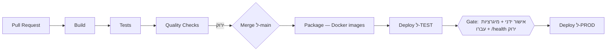

# DevOps — מערכת תמיכות רוחבית (PoC)

עונה על סעיף **DevOps** במטלה: `DEV/TEST/PROD` · `CI/CD` · `ניהול Secrets` ·
`ניהול קונפיגורציה` · `אסטרטגיית Deployment`.

> **היקף.** המטלה קובעת לגבי סעיף זה: *"אין צורך לממש בפועל."* לכן זהו מסמך
> **תכנון בלבד** — אין ב-repo pipeline, workflow, IaC, registry, Kubernetes או
> secret store. מה שקיים (Compose, Dockerfiles, `appsettings`) קיים כדי להריץ את
> ה-PoC, לא כתשתית DevOps.

בכל פרק מסומן מה **קיים**, מה **מתוכנן ל-TEST** ומה **מתוכנן ל-PROD**.

---

## 1. סביבות

| סביבה | אופן הרצה | DB | Configuration | Secrets |
|---|---|---|---|---|
| **DEV** — *קיים* | `cd infra && docker compose up --build`, או [`run-local.ps1`](../run-local.ps1) בלי Docker | SQL Server בקונטיינר (volume `mssql-data`), או LocalDB | `appsettings.json` + `appsettings.Development.json` + env מ-Compose | `infra/.env` מקומי, מתוך [`.env.example`](../infra/.env.example) |
| **TEST** — *מתוכנן* | deploy אוטומטי אחרי merge ל-`main` | מופע ייעודי, נבנה מהמיגרציות | `ASPNETCORE_ENVIRONMENT=Test` + env vars | secret store של הסביבה |
| **PROD** — *מתוכנן* | deploy מתויג בלבד, אחרי אישור ידני | DB מנוהל עם גיבויים | `ASPNETCORE_ENVIRONMENT=Production` + env vars | secret store מנוהל בלבד |

**קיים היום:** הרצה בפקודה אחת ([`docker-compose.yml`](../infra/docker-compose.yml) — `db` + `api` על
`aspnet:8.0` + `client`); הפרדת סביבות כבר בקוד — `Program.cs` פותח Swagger ומריץ
`DbSeeder` **רק ב-Development**; טסטים על SQLite תחת סביבת `Testing`.

**ההבדלים המתוכננים:**

- **TEST** — `Migrate()` כבר רץ בכל סביבה שאינה `Testing`, כך שהסכימה תיווצר לבד
  (אך ראו §5.3). נתוני דמו יצריכו שלב טעינה נפרד, כי ה-seeder רץ רק ב-Development —
  הוא דטרמיניסטי ו-idempotent ולכן מתאים לכך בלי שינוי. Swagger יצריך תנאי סביבה
  נוסף. **פערים מודעים — לא תוקנו; S10 הוא שלב תיעוד.**
- **PROD** — Swagger סגור · **משתמש DB בהרשאות מצומצמות, לא `sa`** (ה-PoC מתחבר
  כ-`sa`) · ריבוי מופעים מאחורי load balancer, שיחייב cache מבוזר במקום
  `IMemoryCache` per-instance ([`DESIGN_QA.md`](DESIGN_QA.md) §5) · client כ-build
  סטטי, לא Vite dev server כמו ב-PoC.

---

## 2. CI/CD — תכנון

**לא מומש.** אין `.github/workflows/`.



*דיאגרמת תכנון בלבד.*

**מתי רץ:** על כל PR ל-`main` — build ובדיקות, ללא deploy; merge חסום עד ירוק.
אחרי merge — אותן בדיקות, ואז package ו-deploy ל-TEST. PROD — רק על tag.

**מה נבדק** — בדיוק מה שרץ היום ידנית, בלי פקודות חדשות:

| שלב | פקודה | הערה |
|---|---|---|
| Build (שרת) | `dotnet build SupportPlatform.sln -c Release` | [`Directory.Build.props`](../server/Directory.Build.props): `TreatWarningsAsErrors` — **אזהרה שוברת build** |
| Tests (שרת) | `dotnet test SupportPlatform.sln` | על SQLite ⇒ אין צורך ב-SQL Server ב-CI |
| Quality + Build + Tests (לקוח) | `npm run lint` · `npm run build` · `npm test` | oxlint · `tsc -b && vite build` · vitest |

**Gates לפני PROD:** הכל ירוק ב-`main` · מיגרציות עברו ב-TEST על סכימה מאפס ·
מעבר על [`TEST_PLAN.md`](TEST_PLAN.md) · `/health` = 200 · אישור ידני + tag.

---

## 3. ניהול Secrets — תכנון

| סוד | נדרש ב- | מצב היום |
|---|---|---|
| Connection string ל-DB | API בכל סביבה | DEV: `infra/.env` → env var |
| סיסמת `sa` של קונטיינר ה-DB | Compose | `MSSQL_SA_PASSWORD` ב-`infra/.env` |
| מפתח API של ספק AI | **אינו קיים** — הספק הממומש דטרמיניסטי, בלי LLM חיצוני | יידרש רק עם ספק חיצוני ([`DESIGN_QA.md`](DESIGN_QA.md) §6) |
| Credentials ל-registry/deploy | CI | אינו קיים — אין CI |

**קיים:** [`.env.example`](../infra/.env.example) הוא תבנית עם ערכי דמה ונמצא ב-repo; ה-`.env`
האמיתי אינו — [`.gitignore`](../.gitignore) חוסם `.env`, `.env.*`, `secrets.json` ו-
`appsettings.*.local.json`, ומחריג רק `!.env.example`. הסודות מגיעים כ-env vars, לא
כקבצים ב-image.

**פער מודע:** `appsettings.Development.json` מכיל connection string עם סיסמת SA של
קונטיינר מקומי חד-פעמי, כדי ש-`dotnet run` יעבוד מ-clone נקי. אינו secret פרודקשן,
אך זו אנטי-דוגמה שלא הייתה נכנסת למערכת אמיתית.

**יעד:** secret store מנוהל (Key Vault / Secrets Manager / Vault) שמוזרק כ-env vars
בזמן ריצה · **Managed Identity** במקום סיסמה היכן שאפשר · **secret נפרד לכל סביבה**
(ל-DEV אין ולא תהיה גישה לסודות PROD) · סודות CI ב-GitHub Secrets ברמת environment
עם approval gate · רוטציה תקופתית.

> **כלל מחייב:** אין לשמור Secrets ב-Git או בקובץ configuration שנכנס ל-repository.
> ערך אמיתי בקובץ מעוקב הוא באג אבטחה, לא נוחות פיתוח.

---

## 4. ניהול Configuration (קיים)

```
appsettings.json                  ברירות מחדל, נכנס ל-image
appsettings.{Environment}.json    עקיפות לפי ASPNETCORE_ENVIRONMENT
Environment Variables             גובר על הכל — מכאן סודות וערכים לכל סביבה
```

env var עוקף מפתח מקונן עם `__`. דוגמה חיה ב-Compose: `ConnectionStrings__SqlServer`
דורס את `ConnectionStrings:SqlServer`.

| מפתח | ברירת מחדל | תפקיד |
|---|---|---|
| `ConnectionStrings:SqlServer` | ריק | חיבור ל-DB; מגיע מ-env בכל סביבה שאינה DEV מקומי |
| `NlQuery:Provider` | `ruleBased` | **בוחר את מימוש ה-AI** |
| `Search:CacheTtlSeconds` | `60` | TTL ל-dedup; `0` מכבה |
| `ASPNETCORE_ENVIRONMENT` | `Development` ב-Compose | Swagger · seed · בחירת קובץ `appsettings` |

**בחירת ספק AI בקונפיגורציה** — `INlQueryProvider` הוא גבול ה-AI היחיד; המימושים
רשומים ב-keyed DI ונבחרים לפי `NlQuery:Provider`. **החלפת ספק = שינוי ערך, לא שינוי
קוד.** מפתח לא מוכר מפיל את האפליקציה בעליה, ולא מתגלה כ-500 בשאלה הראשונה
([`DESIGN_QA.md`](DESIGN_QA.md) §6).

**לקוח** — `VITE_API_PROXY_TARGET` ב-[`vite.config.ts`](../client/vite.config.ts) מכוון את
ה-proxy של `/api/*`. משתני `VITE_*` נחשפים לדפדפן ו**לעולם לא ישמשו להעברת סוד**.

**המסקנה:** אותו image בכל הסביבות; מה שמשתנה הוא environment בלבד.

---

## 5. אסטרטגיית Deployment — תכנון

**5.1 ל-TEST:** אוטומטי מ-`main`, **rolling** — סביבה לא-קריטית שצריכה לשקף את
`main` תוך דקות.

**5.2 ל-PROD: Blue/Green.** מרימים סביבה חדשה לצד הפעילה, בודקים מול `/health`, ורק
אז מעבירים תעבורה. מתאים כאן כי **ה-API חסר-מצב** (הזהות בכותרת בכל בקשה, אין
session) — אפשר להריץ שתי גרסאות במקביל; המצב היחיד שנשמר הוא ה-DB המשותף, ולכן
ההחלפה בטוחה רק בתנאי §5.3; ו**rollback הוא החזרת נתב**, שניות במקום דקות.
מחיר מודע: cache שאינו משותף מתחמם מחדש.

`/health` קיים ([`Program.cs`](../server/src/Api/Program.cs)) וישמש כ-**readiness gate**.
ל-PROD הייתי מרחיבה אותו לבדיקת חיבור DB ומפרידה `live` מ-`ready`.

**5.3 מיגרציות — שלב נפרד מה-Deployment.** *(ההפרדה החשובה בפרק)*

היום `Program.cs` מריץ `Migrate()` בעליה. נוח ל-PoC, **לא נכון לפרודקשן**: כמה מופעים
עולים יחד וממגררים במקביל, וה-deploy נכשל על שגיאת סכימה במקום בשלב ייעודי. היעד:

1. **שלב מיגרציה ייעודי בפייפליין**, לפני deploy האפליקציה.
2. **Additive בלבד.** העיקרון כבר נשמר: `InitialCreate` →
   `TenantAndReferenceFkDeleteBehavior` → `SavedQueriesAndAudit`, והאחרונה יוצרת
   `saved_queries` ו-`audit_log` בלי לגעת בטבלה קיימת.
3. **תאימות לאחור לגרסה אחת** — אחרת אין rollback. מחיקת עמודה נעשית בשני deploy:
   קודם הקוד מפסיק להשתמש בה, ורק אז היא נמחקת.

**5.4 Rollback:** אפליקציה — החזרת תעבורה ל-blue, או ה-image הקודם (מתויג לפי commit).
DB — **אין down-migration בנתיב ה-rollback**; מכיוון שהמיגרציות additive והסכימה
תואמת לאחור, הגרסה הקודמת עובדת מולה כמו שהיא. down-migration בפרודקשן היא מתכון
לאובדן נתונים; אם מיגרציה כן היתה הרסנית, ה-rollback היחיד הוא restore מגיבוי.

---

## 6. מגבלות מודעות

ההיקף נקבע מדרישת המטלה עצמה — *"אין צורך לממש בפועל"* — וההשקעה הופנתה למנוע
השאילתות, להפשטת ה-AI ולתיעוד הארכיטקטוני. **בחירת היקף, לא פער שנשכח:**

| נושא | מצב | הערה |
|---|---|---|
| CI/CD | **לא מומש** | אין `.github/workflows/`. הפקודות שבטבלת §2 רצות היום ידנית וירוקות |
| Deployment אוטומטי | **לא מומש** | אין סביבת TEST/PROD להטמיע אליה |
| IaC | **לא מומש** | `docker-compose.yml` הוא כלי הרצה מקומי, לא IaC |
| Kubernetes / Container Registry | **לא בהיקף** | images נבנים מקומית |
| Secrets Management | **מתואר** | בפועל: `.env` + `.gitignore`. אין secret store פעיל |
| מיגרציות כשלב נפרד | **לא מומש** | היום `Migrate()` בעליה (§5.3) |
| `healthcheck` ל-`db` ב-Compose | **חסר** | `depends_on` פשוט; הרצה קרה ראשונה עלולה להיות racy, `up` שני פותר |
| Client כ-build סטטי | **לא מומש** | Vite dev server — קיצור דרך מכוון |

---

**קישורים:** [`README.md`](../README.md) · [`ARCHITECTURE.md`](ARCHITECTURE.md) ·
[`DESIGN_QA.md`](DESIGN_QA.md) (§5 dedup · §6 ספקי AI · §7 ניטור · §8 תשתיות) ·
[`TEST_PLAN.md`](TEST_PLAN.md)
